# AIBotApp

AIBotApp is a mobile application that uses the Google Gemini API to provide AI-powered responses to user queries. 

## Features

- User authentication using Google Sign-In
- Real-time chat interface with AI-powered responses
- Message history and persistence
- Responsive UI with Material Design
- Support for dark and light themes

## Tech Stack

- Android
- Jetpack Compose
- Room Database
- Firebase Authentication
- Google Gemini API
- Hilt
- Coroutines

## ScreenShorts

    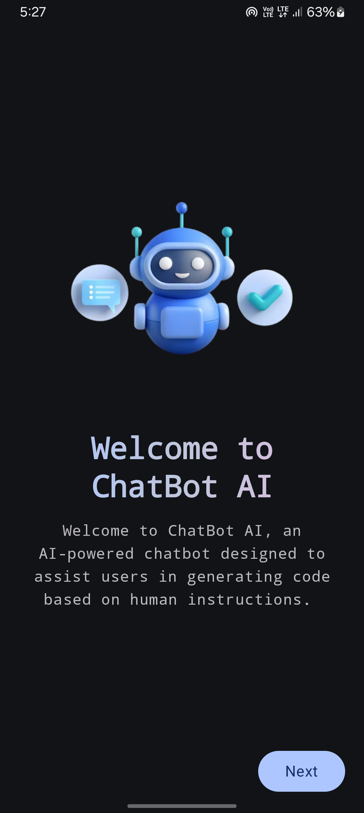
    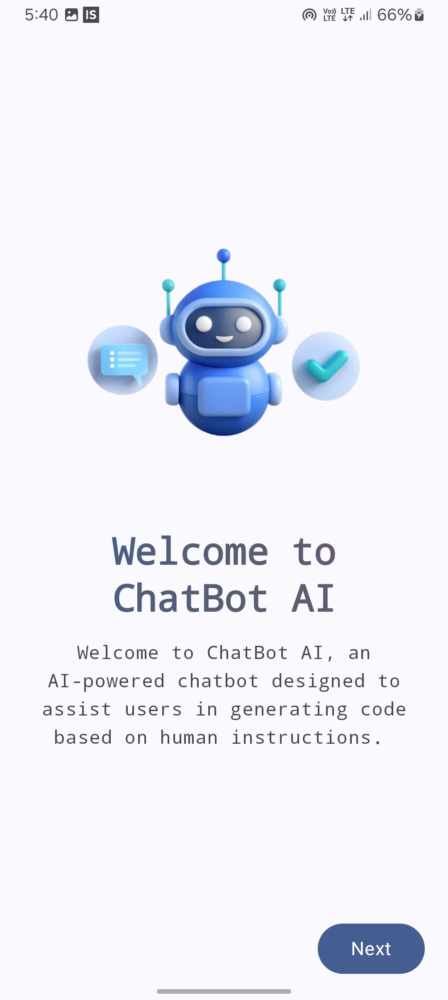
    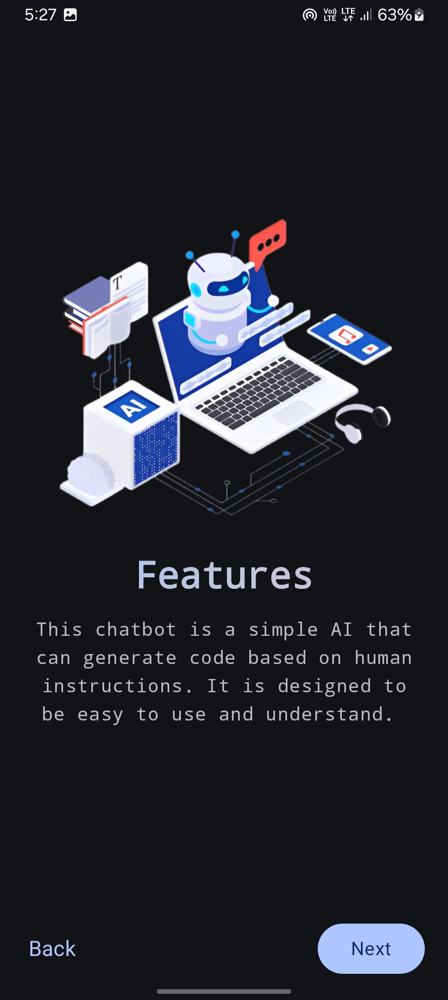
    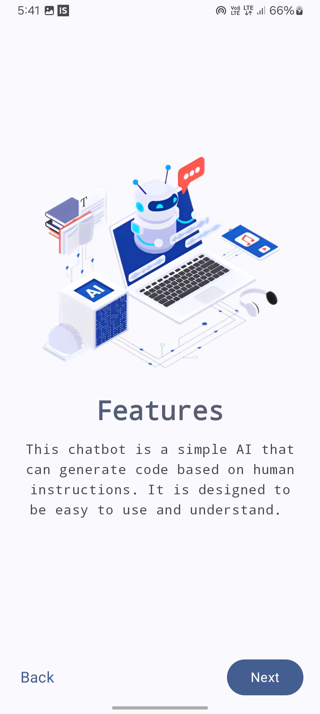
    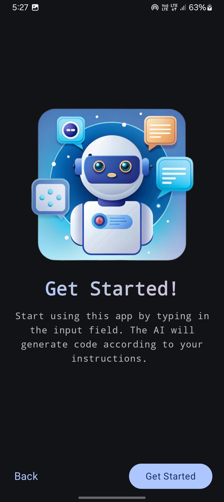
    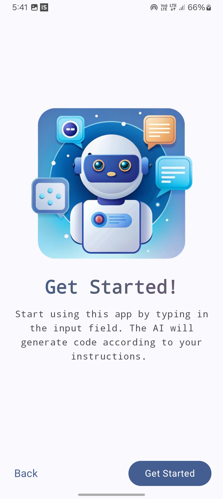
    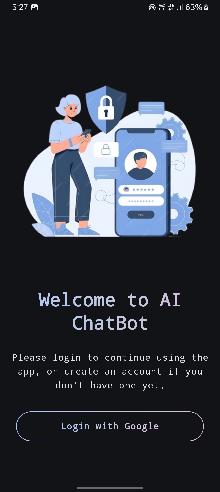
    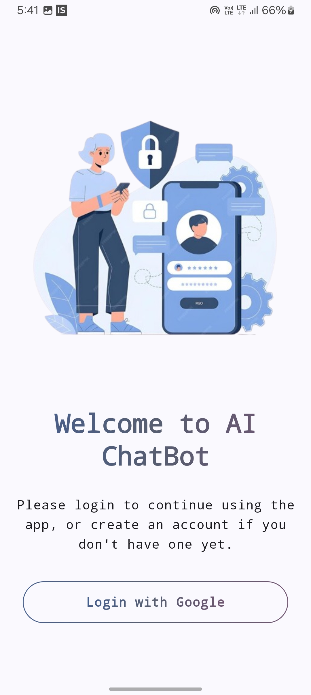
    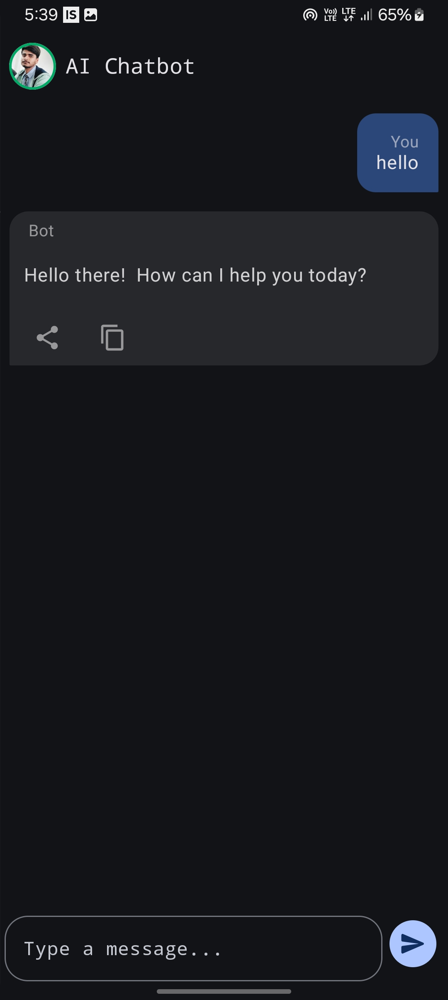
    
    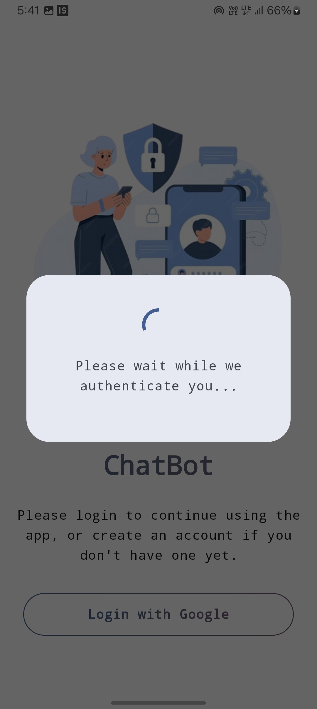
    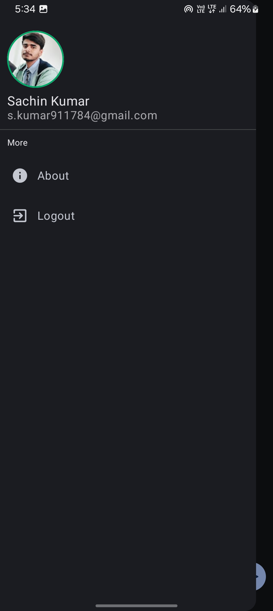
    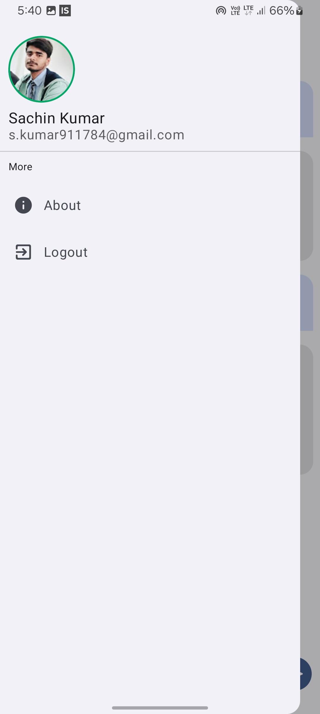
    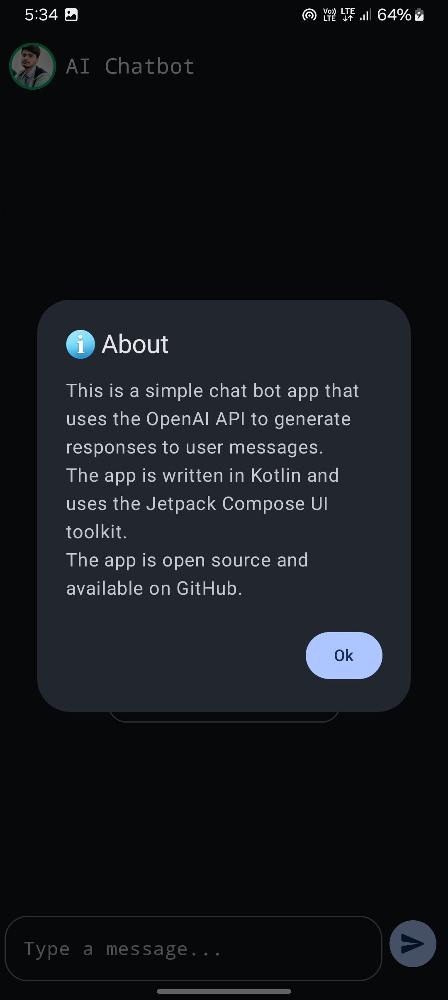
    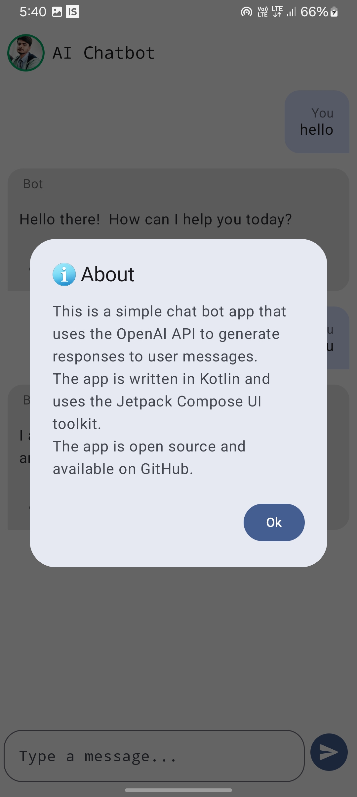

## Setup

1. Clone the repository
2. Add your Google API key to the `build.gradle` file
3. Add your Firebase configuration to the `google-services.json` file
4. Build and run the app

